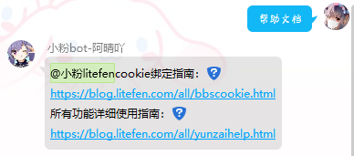
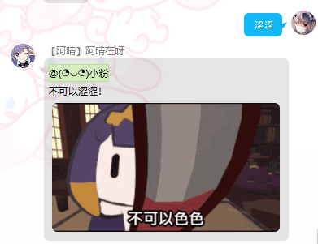
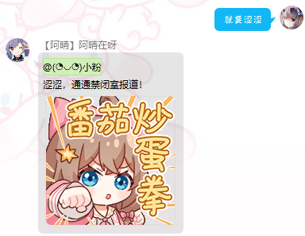
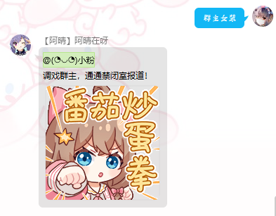
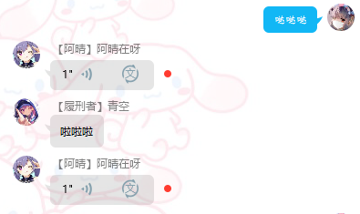
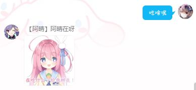
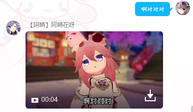

<br>
<p align="center">
<a href="https://blog.litefen.com/all/fenplugin-v3.html" target="_blank">

</a>
</p>
<h1  align="center">粉酱插件v3</h1>
<br>
<p align="center">
🤹 <a  href="https://github.com/litefen/fenplugin-v3" target="__blank"><b> fenplugin-v3 </b></a>一个<a href="https://github.com/Le-niao/Yunzai-Bot" target="__blank"><b>Yunzai-Bot</b></a>的扩展插件，by <a  href="https://github.com/litefen" target="__blank"><b>litefen</b></a> 🧑‍💻
</p>

<p align="center">
<a href="https://github.com/litefen/fenplugin-v3" target="__blank"></a>
<a href="https://github.com/litefen/fenplugin-v3" target="__blank"></a>
<br>
<a href="https://github.com/litefen/fenplugin-v3" target="__blank"></a>
</p>
<p align="center">
  <a href="https://github.com/litefen/fenplugin-v3"><b>Github</b></a> | <a href="https://blog.litefen.com/"><b>小粉litefen</b></a>
</p>
<br>

## 💻 开发进度

#### 2022年9月19日 新建项目文件夹
#### 2022年9月20日 群主涩涩能跑起来了
<br>

## 📝 使用说明
### 🧰 安装


暂不建议安装，敬请期待。。。

在\yunzai-bot\执行

使用[github仓库](https://github.com/litefen/fenplugin-v3)
```bash
git clone --depth=1 https://github.com/litefen/fenplugin-v3.git ./plugins/fenplugin-v3/
```
或者[gitee仓库](https://gitee.com/litefen/fenplugin-v3)

```bash
git clone --depth=1 https://gitee.com/litefen/fenplugin-v3.git ./plugins/fenplugin-v3/
```
### 💻 更新
敬请期待。。。
## 🤹 当前功能
敬请期待。。。
<!-- 
<details>
<summary>
📰 #bot详情 #帮助文档
</br>
</summary>
一个我写的yunzai-bot的所有功能的使用演示和cookie获取合集（不包含ios获取方法）</br>
发送以下命令均可触发</br>
 #cookie详情 #(bot|帮助|使用)(详情|说明使用文档|文档|演示)

</br></br>

</details>

<details>
<summary>
🎥 #涩涩|色色|就要涩涩
</br>
</summary>
不可以涩涩，涩涩就挨打
</br>
</br></br>

🤹 #偏要|就要|偏要|给我涩涩</br>

都说了不可以，涩涩就禁言五分钟（需要bot是管理员）



</details>

<details>
<summary>
🌟 #群主女装|写真|私房|涩涩
</summary>
给发群主女装的通通禁言五分钟（需要是管理员）
</br>
（可以添加自己的名字，打开apps\群主写真.js修改正则为自己的名字即可）
</br>
</details>

<details>
<summary>🎨 全局功能</summary>
代替yunzai的全局表情包、语音功能；增加视频功能；发送文件名触发</br>
查看全局列表
 #(语音|全局表情|视频)(列表|目录|有哪些)</br>
 表情列表和yunzai自带的表情列表重复了，这里改为了全局表情列表触发
</br>

*音频、语音文件`/fenplugin-v3/resources/global/voice/`*
 

</br>

*表情、图片目录`/fenplugin-v3/resources/global/img/`*
 

</br>

*视频文件`/fenplugin-v3/resources/global/video/`*
 


</details> -->


## ⚡️ 可能遇到的问题
敬请期待。。。
## 🌈 其他

敬请期待。。。